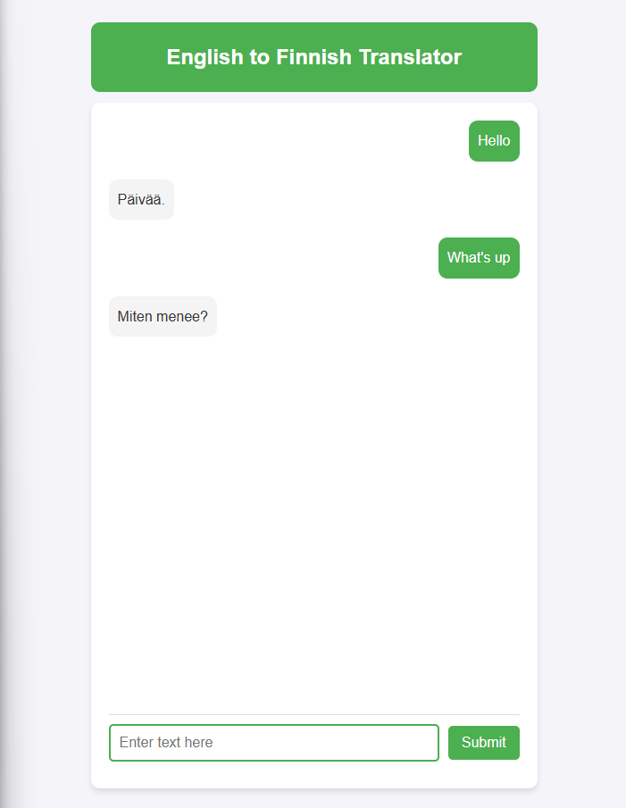

# English to Finnish Translator

This is a simple web-based translator application that translates English text to Finnish using the `Helsinki-NLP/opus-mt-en-fi` model. The application leverages a Flask backend and provides a responsive user interface for translating text.

## Features

- **English to Finnish Translation:** Translate any English text into Finnish with the Helsinki-NLP/opus-mt-en-fi model.
- **User-Friendly Interface:** An easy-to-use web interface to input text and get translations.
- **Real-Time Translation:** Get instant translation results by submitting text via a user-friendly chat-style interface.

## Prerequisites

To run this project locally, make sure you have the following installed:

- Python 3.8+
- pip (Python's package installer)

Additionally, you will need the following Python libraries:

- Flask
- transformers
- torch
- sentencepiece

## Project Structure

```
translator-app/
│
├── app.py              # Flask application backend
├── start.sh            # Shell script to start the app on Linux/Unix
├── start_windows.bat   # Batch script to start the app on Windows
├── requirements.txt    # List of Python dependencies
├── templates/
│   └── index.html      # HTML template for the frontend
├── static/
│   └── styles.css      # Styling for the application
└── README.md           # Documentation
```

## Installation & Setup

1. **Clone the Repository**

   Clone this repository to your local machine:

   ```bash
   git clone https://github.com/MKRadius/AI-English-To-Finnish-Translator.git
   cd AI-English-To-Finnish-Translator
   ```

2. **Install Dependencies**

   Install the required Python libraries from the `requirements.txt` file:

   ```bash
   pip install -r requirements.txt
   ```

3. **Run the Application**

   Depending on your operating system, choose the appropriate script to run the application.

   - **For Linux/Unix**:
     Use the `start.sh` script:

     ```bash
     ./start.sh
     ```

   - **For Windows**:
     Use the `start_windows.bat` script:

     ```bash
     ./start_windows.bat
     ```

   This will start the Flask application on `http://127.0.0.1:5000/` (or another available port). Open this URL in your browser to access the translator.

## How It Works

1. **Frontend (HTML + JavaScript)**

   - The frontend is built with basic HTML and JavaScript. It contains a text input field and a submit button.
   - When the user types text and submits it, an asynchronous request is made to the Flask backend using the `fetch` API.
   - The result is displayed as a chat-style message with the translation.

2. **Backend (Flask + Hugging Face Transformers)**

   - The Flask backend handles two main routes:
     - `/` serves the main page (`index.html`).
     - `/translate` handles POST requests, where the input text is sent to the Helsinki-NLP/opus-mt-en-fi translation model from Hugging Face.
   - The translation result is returned in JSON format to the frontend, where it is displayed.

3. **Translation Model (Helsinki-NLP/opus-mt-en-fi)**

   - The translation is done using the `pipeline` API from Hugging Face's `transformers` library.
   - The model `Helsinki-NLP/opus-mt-en-fi` is used to perform the translation from English to Finnish.

## Screenshots



## Troubleshooting

- **Error: "No translation found"**: This could occur if the input text is already in Finnish or too short for a translation. The app will not return a translation in such cases.
- **Error: "Error occurred"**: If an error occurs during the translation process, check the browser console for more details.

## Customization

1. **Styling**: You can customize the look of the app by editing the `styles.css` file in the `static/` folder.
2. **Translation Model**: You can swap the model for a different translation model by modifying the `pipeline` call in the `app.py` file.
